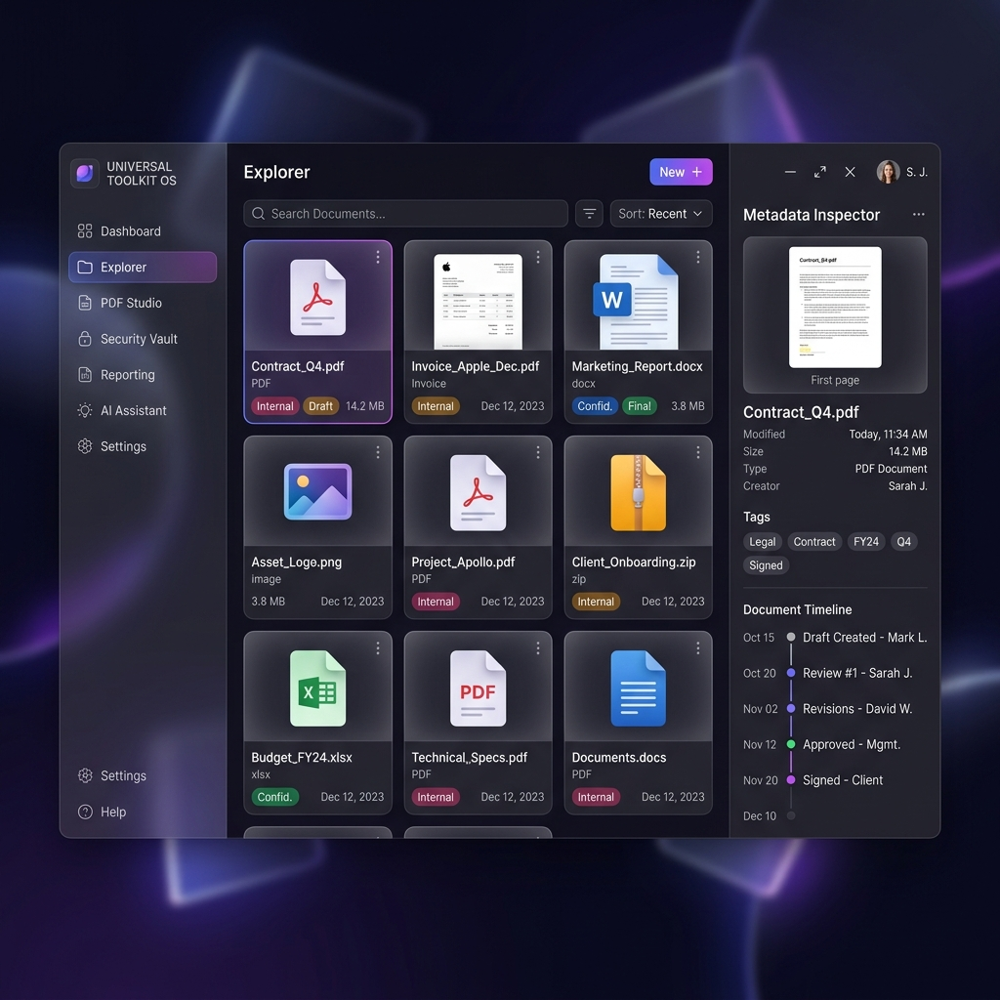

# Universal Toolkit

A local-first desktop application for document organization, search, processing, and secure storage.

Built with Rust, Tauri, React, TypeScript, SQLite, and Python, Universal Toolkit combines document indexing, full-text search, PDF utilities, Office document tools, encrypted storage, and relationship visualization into a single desktop application.

## Overview

Universal Toolkit helps users manage large collections of documents without relying on cloud services.

The application indexes files stored on local drives, extracts searchable content, stores metadata in SQLite, and provides tools for working with PDFs, Office documents, images, and encrypted archives.

All processing is performed locally on the user's machine.

## Features

### Document Explorer

Browse and manage documents through a three-pane interface:

- Folder tree navigation
- Grid and list views
- File previews
- Metadata inspection
- Relationship visualization
- Version history access

**Supported file types include:**
PDF, DOCX, XLSX, CSV, PNG, JPG, JPEG, WEBP, TIFF, BMP

### Full-Text Search

Universal Toolkit uses SQLite FTS5 to provide fast local search.

**Features:**
- Filename search
- Content search
- Metadata search
- Entity search
- Relationship-aware search
- Saved filters

**Example queries:**
- `amazon invoices`
- `contracts signed in 2025`
- `receipts related to invoice A102`
- `resume rust developer`

### PDF Studio

Built-in PDF utilities:
- Merge PDFs
- Split PDFs
- Rotate pages
- Add watermarks
- Encrypt PDFs
- Compress documents
- Convert images to PDF

### Office Studio

Tools for working with Office documents:
- DOCX template processing
- Spreadsheet preview
- CSV import/export
- XLSX inspection
- Document generation

### Security Vault

Encrypted storage for sensitive files.

**Security implementation:**
- AES-256-GCM encryption
- Argon2 password hashing
- Per-file encryption
- Secure temporary previews

**Features:**
- Create vaults
- Lock/unlock vaults
- Store protected documents
- Move files into secure storage
- View vault contents

### Knowledge Graph

Visualize relationships between documents.

**Features:**
- Interactive graph canvas
- Manual relationship creation
- Relationship filtering
- Connected document discovery
- Category-based organization

**Supported relationship types:**
- Invoice → Receipt
- Contract → Amendment
- Statement → Transaction
- Resume → Supporting Document

### Timeline & Versioning

Track document history over time.

**Timeline events:**
- Created
- Modified
- Renamed
- Moved
- Archived
- Restored

**Versioning features:**
- Create snapshots
- Restore previous versions
- Compare revisions
- Store version notes

### Reporting

Generate reports about your document collection.

**Available reports:**
- Storage usage
- File type distribution
- Duplicate files
- Vault usage
- Search activity
- Workspace growth

**Export formats:**
PDF, CSV, XLSX

### Backup & Recovery

Built-in backup system.

**Features:**
- Manual backups
- Scheduled backups
- Backup validation
- Restore operations

**Backed up data includes:**
- SQLite database
- Settings
- Metadata
- Version history
- Vault metadata

## Architecture

- **Frontend:** React, TypeScript, Tailwind CSS, Zustand, React Flow
- **Desktop Layer:** Rust, Tauri
- **Storage:** SQLite, FTS5
- **Processing:** Rust Services, Python Sidecar
- **Security:** AES-256-GCM, Argon2

## Project Structure

```text
Universal_toolkit/
│
├── src/                 # React frontend
├── src-tauri/           # Tauri desktop application
├── database/            # SQLite repositories & migrations
├── indexing/            # File scanning and indexing
├── intelligence/        # Entity extraction & search logic
├── automation/          # Background workers
├── plugins/             # WASM plugin runtime
├── backend/             # Python sidecar services
├── core/                # Shared Rust models
└── docs/                # Documentation
```

## Building

### Requirements
- Node.js 20+
- Rust stable
- Cargo
- Python 3.11+
- Tauri CLI

### Install

```bash
git clone https://github.com/dillibabu-06/Universal-Document-Toolkit.git
cd Universal-Document-Toolkit
npm install
```

### Development
```bash
npm run tauri dev
```

### Production Build
```bash
npm run build
npm run tauri build
```

## Screenshots

### Dashboard
<p align="center">
  
</p>

### Explorer
*(Screenshot pending)*

### Knowledge Graph
*(Screenshot pending)*

### Security Vault
<p align="center">
  
</p>

### PDF Studio
*(Screenshot pending)*

## Current Status

- **Version:** 1.0.0
- **Status:** Stable Release
- **Supported Platforms:** Windows 10 / 11, macOS (Intel & Apple Silicon), Linux (AppImage / DEB)

## Privacy

Universal Toolkit is designed as a local-first application.
- No cloud account required
- No document uploads
- No external AI services required
- Data remains on your machine

## License

MIT License. See LICENSE for details.

## Acknowledgements

Open-source technologies used:
Rust, Tauri, React, TypeScript, SQLite, FastAPI, Tailwind CSS, React Flow, Wasmtime
